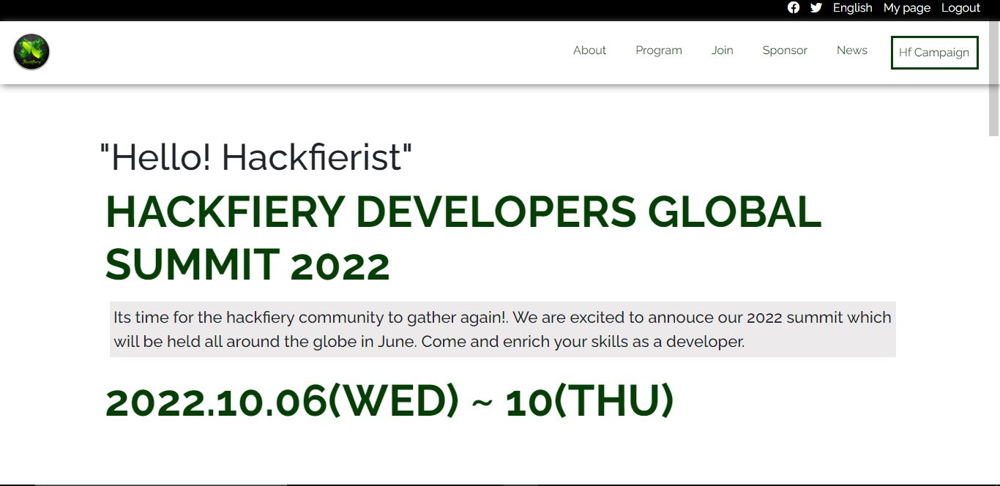

# HACKFIER DEVELOPERS GLOBAL SUMMIT

> Hackfiery Developers Global Summit website which showcase programs outline, date and speakers that will be available during the program.

Additional description about the project and its features.

## Built With

- HTML
- CSS
- Javascript
- Webhint
- Stylelint
- Eslint

## Live Demo

[Live Demo Link](https://amedzro-elikplim.github.io/Hacfiery-Developers/)

## Getting Started

To get a local copy up and running follow these simple example steps.

### Prerequisites

- Knowledge on basic html css and javascript
- Text Editor (VScode, Atom, Sublime text, etc)
- Basic knowledge of node.js

### Setup

- clone repository using `git clone`
- run `npm install`
- run `live server`

## Author

👤 **Amedzro Elikplim Emmanuel**

- GitHub: [@Amedzro-Elikplim](https://github.com/Amedzro-Elikplim)
- Twitter: [@ElikplimAmedzro](https://twitter.com/Amedzro-Elikplim)
- LinkedIn: [Emmanuel Elikplim Amedzro](https://www.linkedin.com/in/emmanuel-elikplim-amedzro-187590125/)

## Original designer
👤 **Cindy Shin(GUI and Graphic designer)**

[View original design](https://www.behance.net/gallery/29845175/CC-Global-Summit-2015)
## 🤝 Contributing

Contributions, issues, and feature requests are welcome!

Feel free to check the [issues page](../../issues/).

## Show your support

Give a ⭐️ if you like this project!

## 📝 License

This project is [MIT](./LICENSE) licensed.
